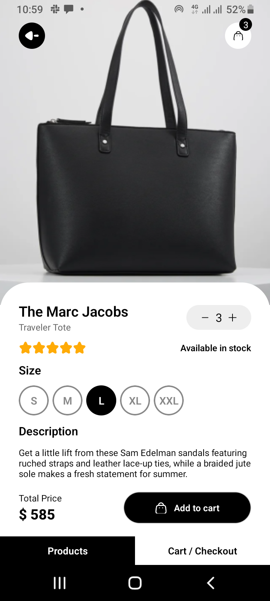
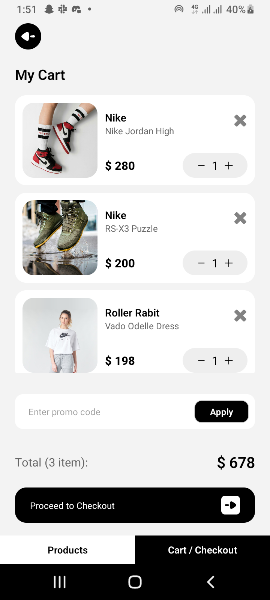
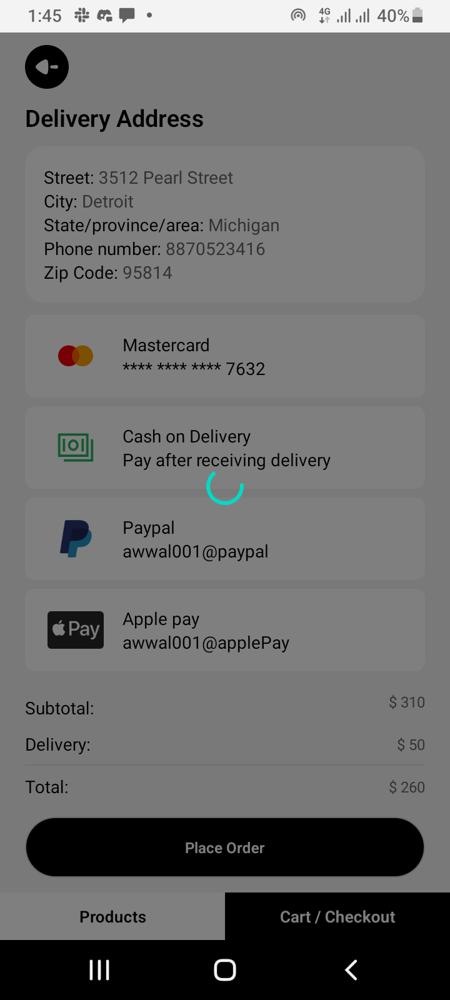

# Clothing Items Shopping App

Welcome to the Clothing Items Shopping App! This app is built using React Native Expo. It is an app for shopping clothing items from static data shipped with the app (No backend).

## Screenshots

* Displays clothing items and navigation options.

* Shows detailed information about a selected product. Has a size picker to pick preferred size of the clothing item. Has a button to set number of clothing items you want.  Has a navigation bar on top of the screen to go to cart screen and previous screen

* Shows the items added to cart. The quantity of each item in the cart can be changed directly from the cart screen. The corresponding price is updated each time the quantity is modified. Has a navigation bar on top to go to previous screen

* Shows the items delivery address. Allows user to select a payment method and proceed to checkout. Has a navigation bar on top to go to previous screen.

## Features

- Add/Remove Items from Cart: Browse through the catalog and add items to the cart. You can also remove items if you change your mind.
- Modify Item Quantities: Directly from the cart, you can increase or decrease the quantity of any item.
- Checkout Process: Proceed to checkout from the cart screen, select a payment method, and place your order. When the cart is empty, the checkout button is disabled, preventing proceeding to checkout with an empty cart.
- Order Completion: Once an order is completed, the cart is emptied, ready for your next shopping spree.

## Technical Details

- This project uses only the primary packages needed to build a React Native Expo app with the blank setup. No additional libraries are used, even for navigation. Instead, a custom navigation system based on React state was implemented to manage screen transitions within the app.

## Virtualized Demo

View the app Demo on appetize.io

[Demo link](https://appetize.io/app/b_w7n46disqzmtl3ooblqdhqhg3m)

## APK Download

Download the APK file to install the app on your Android device:

[Download APK](https://drive.google.com/file/d/1MYIB53gVju5vaAcsuulefE08ZuoGSNqK/view?usp=drive_link)
